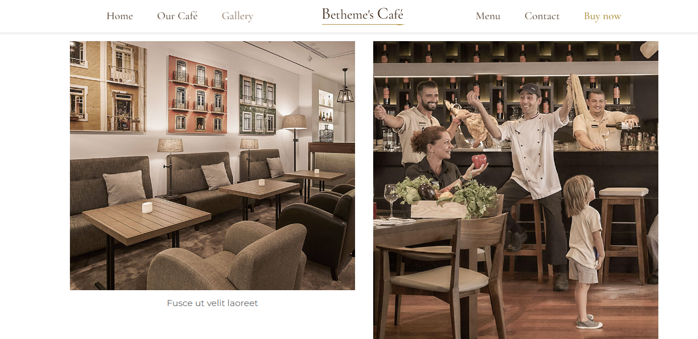

## مقدمه

این پروژه به شما کمک می‌کند تا وب‌سایتی جذاب و کاربردی برای یک کافی‌شاپ طراحی کنید. ما در اینجا از HTML و CSS برای پیاده‌سازی طراحی استفاده می‌کنیم. خلاق باشید؛ طراحی شما نیازی به شباهت با نمونه‌های نشان داده شده ندارد.

## صفحه اصلی وبسایت

وب‌سایت شامل یک صفحه خواهد بود که اطلاعات مربوط به کافی‌شاپ را در خود جای داده است. در ادامه، به تفصیل به هر بخش می‌پردازیم.

## نوار منو

نوار منویی در بالای صفحه وب‌سایت قرار دارد که شامل لینک‌هایی به بخش‌های کلیدی وب‌سایت است. می‌توانید از رنگ‌های گرادیانت برای زیبایی بیشتر استفاده کنید. یک نمونه نوار منو در تصویر زیر آمده است.

## توضیحات کافی‌شاپ

در بخش ابتدایی وب‌سایت، اطلاعاتی در مورد کافی‌شاپ از قبیل موقعیت، ساعات کاری و تصاویری از محیط آن قرار دهید. یک نمونه از این بخش در تصویر زیر دیده می‌شود.

## منوی کافی‌شاپ

وب‌سایت باید دارای بخش منو با دسته‌بندی‌های مختلف باشد، مانند نوشیدنی‌ها، کیک و غیره. باید امکان انتخاب دسته‌های مختلف توسط کاربران وجود داشته باشد. همچنین، قیمت و توضیحات مختصری از هر آیتم به همراه تصاویر آن‌ها ارائه دهید. یک نمونه از منو و امکان انتخاب دسته‌بندی‌ها در تصاویر زیر نشان داده شده است.

## گالری

یک بخش گالری برای نمایش تصاویر جذاب از کافی‌شاپ ایجاد کنید تا مشتریان بتوانند با محیط کافه بهتر آشنا شوند. یک نمونه از این بخش در تصویر زیر آمده است.

## رزرو

بخشی برای رزرو آنلاین با فیلدهایی همچون مشخصات مشتری، تعداد نفرات، زمان رزرو و انتخاب سفارش ایجاد کنید. با کلیک بر گزینه‌ی سفارش، لیستی از آیتم‌ها نمایش داده شود که کاربر می‌تواند با کلیک بر روی هر یک، آن را به سبد خرید خود اضافه کند.

## مراجع

برای طراحی خود می‌توانید از وب‌سایت‌های زیر ایده بگیرید:
- [مافین گروپ کافه](https://themes.muffingroup.com/be/cafe/)
- [مافین گروپ کافه ۲](https://themes.muffingroup.com/be/cafe2/)
- [منوی کافه پاتاشو](https://www.cafepatachou.com/cafe-patachou-menu/)